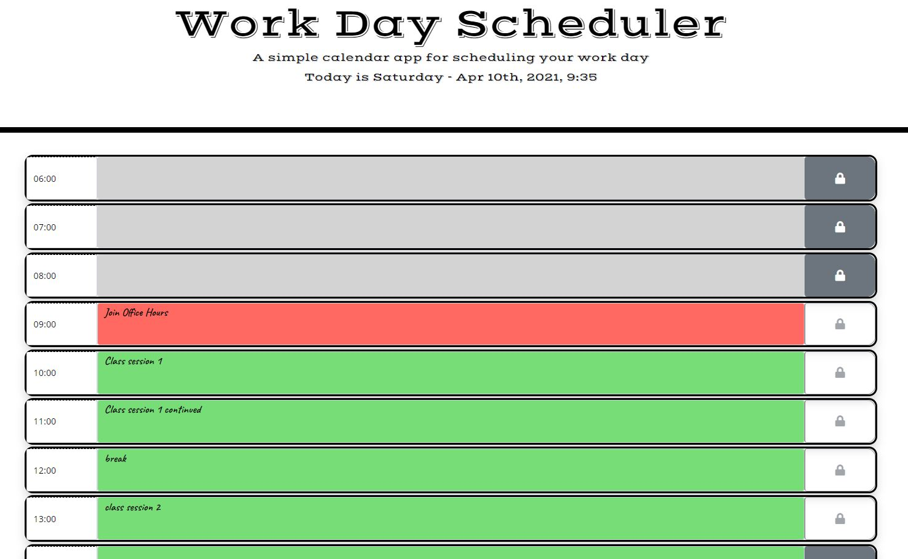
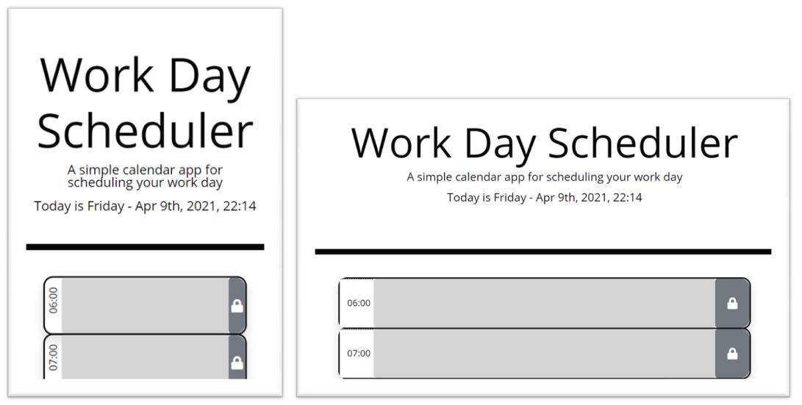
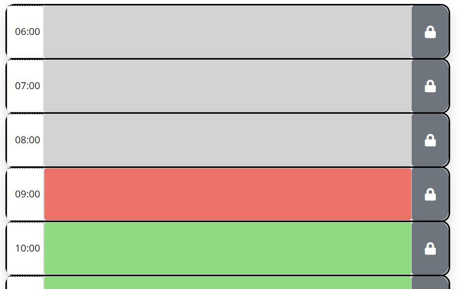
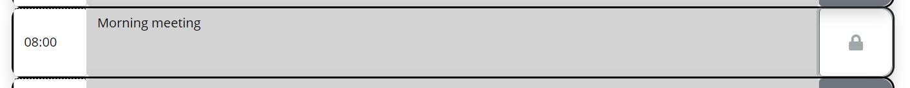

# Day Planner

https://brownnicholasj.github.io/day_planner/

## Description

The day planner will allow a user to schedule their day and save events
throughout the day. It compares the current date/time with the schedule and
color codes the time.

- Allows the user to put important events/tasks throughout the day
- The day planner also allows a user to prioritize their schedule and check off
  as completed
- Allows the user to have a virtual day planner that they can access, yet still
  separate from email/shared calendars (private list)
- Putting this solution together, it taught me a lot about traversing the DOM
  and quick/non-repetitive steps to format the page/table.

## Table of Contents

- [Features](#features)
- [Credits](#credits)

## Features

The page has a mobile first design, allowing users to utilize the page from a
smaller screen along with larger screen.
  The page utilizes dayjs
date/time library to gather the current time and dates. We utilize that to
dynamically colorize the table [grey for past, red for present, and green for
future]   The user is able to
input text into the text area. If the user wants to save their text to local
storage, they can press the save/lock icon. It will change color when saved and
hold that color when saved... to unsave/clear the local storage, the user can
push the button again.   The
time blocks allow the user some 'grace' time before and after regular business
hours to account for time zone differences. It starts at 06:00 and ends at
18:00. [times are also shown in military time]  The local storage matches
current date with storage date, meaning... If you save information on a
different date then the current date, it will not load into the textarea.

## Credits

The formatting of the webpage utilizes Bootstrap (https://getbootstrap.com/).
  The formatting of the webpage utilizes FontAwesome
(https://fontawesome.com/)  The formatting of the webpage utilizes Google
fonts (https://fonts.google.com/)  The date functionality of the webpage
utilizes Dayjs date library.
